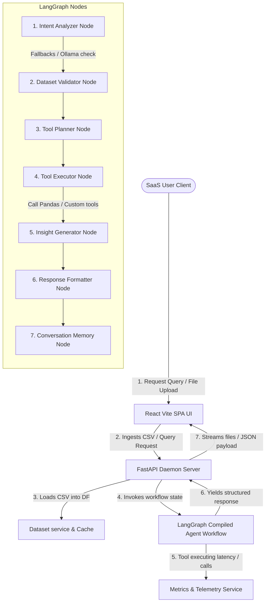

# Smart CSV Data Analyst Agent

[](https://github.com/your-username/smart-csv-data-analyst-agent/actions)
[](https://opensource.org/licenses/MIT)
[](https://www.python.org/)
[](https://nodejs.org/)

An enterprise-ready, high-fidelity AI-powered SaaS analytics platform. This application integrates an ultra-modern React + Vite dashboard on the frontend with a modular FastAPI backend running local LLMs (via Ollama Llama3) and multi-agent workflows (via LangGraph/LangChain) to analyze uploaded CSV datasets.

---

## 🚀 Key Features

* **📊 Executive AI Dashboard**: Displays 12 dynamic corporate KPI cards (Revenue, Order Volumes, Net Profit, Growth Rates, AOV, Product performance, category concentrations) with interactive dimensional slicers.
* **🔍 AI Thematic Dashboard Generator**: Rebuilds visual layout grids on demand via natural language queries (e.g., *"Create marketing dashboard"*).
* **🧠 TTL-based Smart Caching**: Caches repeated analytical questions, chart calculations, summaries, and statistics to maximize performance.
* **📋 Dynamic AI Reports & Exporters**: Generates high-fidelity PDF (ReportLab) and corporate PowerPoint slides (python-pptx).
* **📈 SVG Zoom/Pan Canvas**: Interactive chart viewer with full zooming, panning, and fullscreen support.
* **⚙️ Live LangGraph Node Visualizer**: Renders the complete node execution connection tree (*Intent Analyzer -> Dataset Validator -> Tool Planner -> Tool Executor -> Insight Generator -> Response Formatter -> Conversation Memory*) showing timing latencies in real-time.
* **💾 Telemetry & Query Audit Logs**: Full history logging with deletion controls, filters, and JSON/CSV backup exports.
* **🚀 One-Click Demo Mode**: Deploys a mock financial sales dataset immediately to bootstrap the analytics context.

---

## 🎨 System Architecture



---

## 📂 Folder Structure

```
smart-csv-data-analyst-agent/
├── .github/
│   ├── ISSUE_TEMPLATE/       # GitHub bug / feature issue templates
│   ├── workflows/            # GitHub Actions CI/CD workflows
│   └── PULL_REQUEST_TEMPLATE # Git PR merge checklist template
├── backend/                  # FastAPI Application
│   ├── app/
│   │   ├── api/              # API Route endpoints (health, upload, chat, analytics, settings)
│   │   ├── core/             # Base configurations, exceptions, logging handlers
│   │   ├── graph/            # LangGraph workflow node execution schemas
│   │   ├── services/         # PDF, PowerPoint, Cache, Settings, and Metrics services
│   │   └── tools/            # Pandas statistical calculations tools
│   ├── uploads/              # Local storage uploads folder (contains metadata.json)
│   └── tests/                # Backend pytest modules
├── frontend/                 # React SPA Client
│   ├── src/
│   │   ├── components/       # Reusable layout and custom visual tools
│   │   └── pages/            # Dashboard, Upload, Chat, Charts, Reports, Settings, History, System
├── docker/                   # Custom Nginx configurations
├── Dockerfile.backend        # Backend build container
├── Dockerfile.frontend       # Frontend build container
├── docker-compose.yml        # Multi-container orchestration configurations
└── render.yaml               # Render Cloud deployments yaml
```

---

## 🛠️ Getting Started

### Prerequisites
* **Node.js**: v18+ (tested on v20)
* **Python**: v3.9+ (tested on v3.11)
* **Ollama**: Installed and running locally (`ollama run llama3`)

### 1. Local Environment Setup

#### Backend Setup
```bash
cd backend
python -m venv venv
# Activate
.\venv\Scripts\Activate.ps1    # Windows PowerShell
source venv/bin/activate       # Linux/macOS

pip install -r requirements.txt
cp ../.env.example .env
python -m uvicorn app.main:app --reload
```
API runs locally at `http://localhost:8000`.

#### Frontend Setup
```bash
cd frontend
npm install
npm run dev
```
Access client in browser at `http://localhost:5173`.

---

### 2. Docker Setup

Build and spin up the complete platform in the background:
```bash
docker-compose up --build -d
```
* **Frontend client**: Available at `http://localhost`.
* **FastAPI Server**: Running at `http://localhost:8000`.
* Backend container proxies Ollama connection to your host machine local port `11434`.

---

## ⚡ API Documentation Reference

* `GET /api/health` - Basic server diagnostic health checks.
* `POST /api/upload/upload` - Ingests CSV files, validating checksums and corruption.
* `POST /api/upload/demo` - Trigger demo mode, auto-populating workspace variables.
* `POST /api/chat/query` - Queries the LangGraph multi-agent planning workflow.
* `GET /api/analytics/overview/{upload_id}` - Computes 12 corporate KPI cards.
* `GET /api/report/pdf/{upload_id}` - Downloads high-fidelity ReportLab PDF report.
* `GET /api/report/pptx/{upload_id}` - Downloads slide deck presentation.
* `GET /api/report/export/zip/{upload_id}` - Downloads ZIP export bundle (PDF, PPTX, XLSX, JSON, MD).
* `GET /api/system/metrics` - Live FastAPI engineering telemetries.

---

## 🚀 Cloud Deployment Readiness

- **Vercel / Netlify**: Configure root directory to `./frontend`, set output folder to `dist`, and point backend environment configs to active server.
- **Render / Railway**: Launch python backend environments, mount `/app/uploads` persistent block disk partition, and set container ports. Review [render.yaml](render.yaml) for full Render specs.

---

## 🗺️ Roadmap & Future Enhancements
* Support multi-sheet Excel file ingestions.
* Connect SQL warehouses directly for analytical mapping.
* Integrate cloud LLM pools (OpenAI / Anthropic) with token usage tracking.
* Expand diagram builders using Chart.js interactive layers.

---

## 🤝 Contributing
Please review [CONTRIBUTING.md](CONTRIBUTING.md) and [CODE_OF_CONDUCT.md](CODE_OF_CONDUCT.md) for full development covenants.

---

## 📄 License
This project is licensed under the MIT License. Review [LICENSE](LICENSE) for full details.
